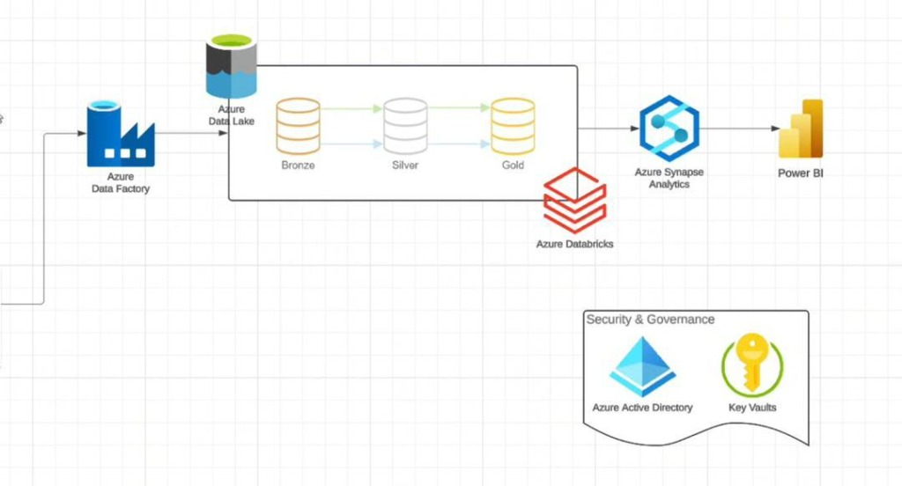
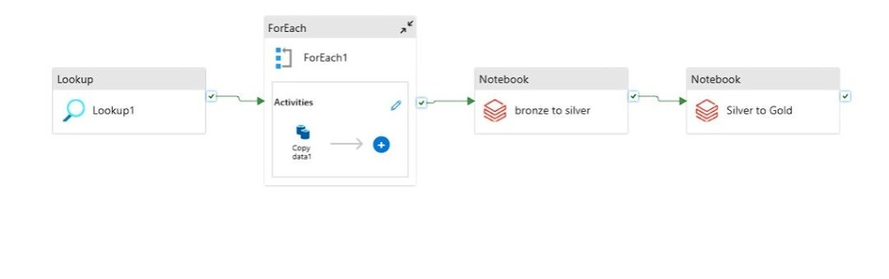
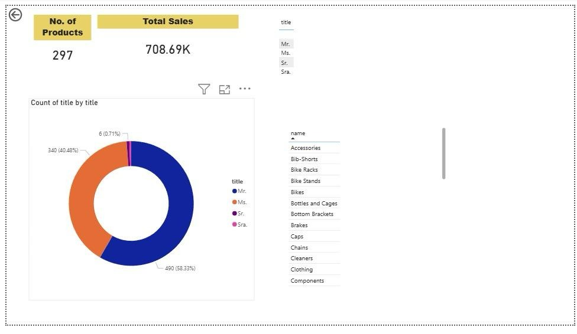

# ☁️ End-to-End Azure Data Engineering Medallion Pipeline

An enterprise-grade, end-to-end cloud data engineering pipeline built on Microsoft Azure. This pipeline ingests transactional database tables, stores them in **Azure Data Lake Storage Gen2 (ADLS Gen2)**, performs scalable PySpark transformations using **Azure Databricks** following the **Medallion Architecture (Bronze ➡️ Silver ➡️ Gold)**, loads the data into **Azure Synapse Analytics**, and exposes key metrics via a **Power BI** dashboard.

The entire cloud infrastructure is provisioned programmatically via the ARM template located in [infrastructure/template.json](infrastructure/template.json).

---

## 🏗️ Architecture & Data Flow

Below is the conceptual architecture of the data pipeline:



### 🌊 Ingestion & Storage (Bronze)
*   **Azure Data Factory (ADF)** orchestrates the entire ingest pipeline. A `Lookup` activity queries the transactional database metadata, and a `ForEach` loop parallelizes `Copy Data` activities to stream raw tables into the **Bronze** layer of **Azure Data Lake Storage (ADLS) Gen2** as CSV files.
*   **Infrastructure:** ADLS Gen2 is configured with Hierarchical Namespace (HNS) enabled for high-performance directory-level access.

### 🧹 Cleaning & Refining (Silver)
*   **Azure Databricks** PySpark notebooks are triggered by ADF to read files from the Bronze layer.
*   The data is cleaned (data types cast, column names normalized, null values handled) and written to the **Silver** layer in **Delta Lake** format.

### 📈 Metrics & Aggregation (Gold)
*   A second PySpark notebook reads the Silver Delta tables and performs business-level aggregations and dimensional modeling (generating Star Schema tables).
*   The refined datasets are written to the **Gold** layer of ADLS Gen2.

### 🏛️ Data Warehousing (Synapse) & Serving
*   **Azure Synapse Analytics** queries the Gold Delta tables to serve as the serving layer for business intelligence.
*   **Power BI** connects directly to Synapse to create interactive executive reporting dashboards.

---

## 🔑 Security & Governance

Security is baked into the pipeline at every level:
*   **Azure Key Vault** acts as the central secret store, housing database passwords, client secrets, and access tokens securely.
*   **Azure Active Directory (Entra ID)** controls access controls (RBAC) across Synapse, Databricks, Data Factory, and Key Vault.
*   Databricks mounts ADLS Gen2 containers securely using Key Vault secrets, preventing hardcoded credentials in notebooks.

---

## 🖥️ Pipeline & Dashboard Visualizations

### 1. Azure Data Factory Orchestration
The ingestion workflow utilizes lookup metadata to loop through tables and copy them in parallel before triggering the Databricks processing notebooks:



### 2. Power BI Sales Analytics Dashboard
The final reporting layer displays executive-level insights such as product counts, total sales volume, demographics, and product category breakdowns:



---

## 🛠️ Infrastructure Resources (ARM Template)
The Azure resources configured in [infrastructure/template.json](infrastructure/template.json) include:

| Resource Name | Service Type | Role in Pipeline | Configuration |
| :--- | :--- | :--- | :--- |
| `intechsg22` | `Microsoft.Storage/storageAccounts` | ADLS Gen2 Data Lake | Standard_LRS, HNS Enabled |
| `intech-keyvault22` | `Microsoft.KeyVault/vaults` | Secret Storage | Standard SKU |
| `intech-databricks` | `Microsoft.Databricks/workspaces` | Data Transformation Engine | Premium SKU |
| `intech-synapse22` | `Microsoft.Synapse/workspaces` | Data Warehousing & Serving | Developer/Standard |

---

## 🚀 How to Replicate

1. **Deploy Infrastructure**
   Deploy the resources to your Azure Subscription using the Azure CLI:
   ```bash
   az deployment group create --resource-group <your-resource-group> --template-file infrastructure/template.json
   ```

2. **Set Up Key Vault Secrets**
   Add your credentials (`username`, `password`, `databricks-key`) to the Azure Key Vault.

3. **Deploy Data Factory Pipelines**
   Configure your ADF linked services to connect to your Source DB and ADLS Gen2, then import the ADF pipelines.

4. **Run Databricks Notebooks**
   Import the transformation notebooks into Databricks, link them to your ADF workspace, and trigger the main run.
